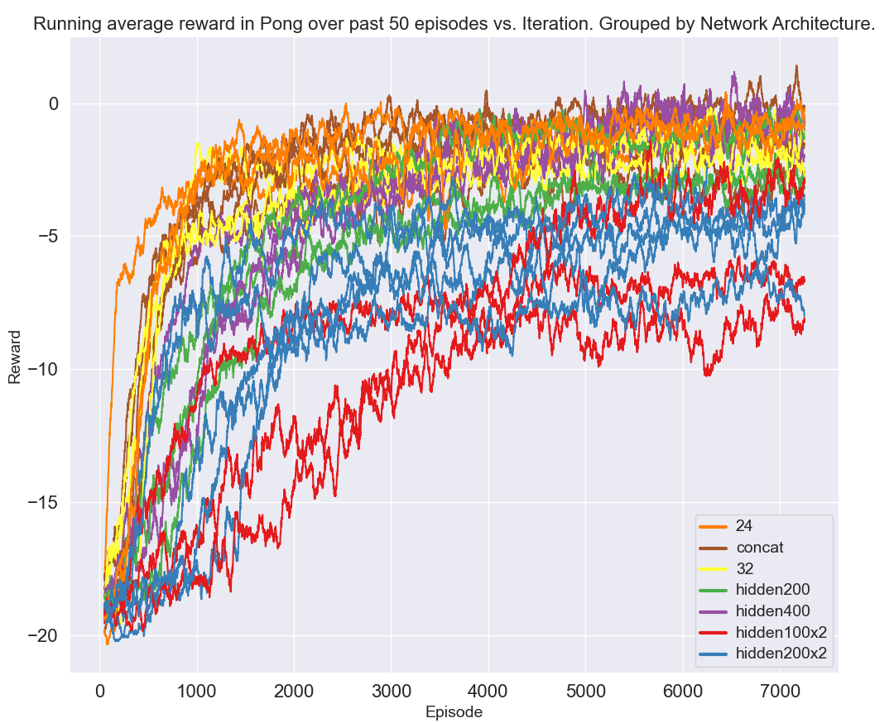

# Neural Network Agent for Atari Pong with Policy Gradient
## Description

This project explores the development of a neural network agent trained to play the Atari game Pong using a policy gradient learning algorithm. It delves into various neural network architectures, emphasizing the effectiveness of dense and convolutional layers in reinforcement learning environments.

## Technologies Used

Programming Language: Python
Libraries: TensorFlow, Keras, Gymnasium. Seaborn for plots

## Methodology

Adapted reinforcement learning techniques for the Atari Pong environment.
Experimented with different neural network architectures including dense and convolutional layers. Also experimented with layer skipping.
Extensive hyper-parameter tuning to optimize performance.

## Results

Developed neural network configurations that improved over time and were capable of defeating the Atari AI.

After 500 episodes:

After 7500 episodes:

Reward over time with different hyper-parameters:

### Network depth comparison using feature maps

One take away from this project was the impact of network depth on the 'readability' of extracted features.

CNN with 4 layers:

CNN with 3 layers:

Note the clarity and resolution of the extracted features by the final layer. At a certain point adding layers proved detrimental.

## Installation and Usage

To install gymnasium with the necessary Atari ROMs, follow instructions [here](https://gymnasium.farama.org/environments/atari/).

Run graphical_pong_reinforce.py to train an agent with real time result plotting and to spectate agent performance after a defined episode interval. (This will be slower)

Run ng_pong_reinforce.py to train an agent without result plotting and game playback. Reward and episode info will still be displayed in the console.

Both use the same default parameters that should work decently out of the box for Pong. Other games can work but require more fiddling. Both programs take the following parameters: episodes, learning rate, discount factor, network (these are defined in classes in the networks directory) and finally optimiser.

Both

## Acknowledgements

Much of the approach was taken after reading Andrej Karpathy's blog post[Deep Reinforcement Learning: Pong from Pixels](http://karpathy.github.io/2016/05/31/rl/). The code is a modified version of [this repo by gabrielgarze](https://github.com/gabrielgarza/openai-gym-policy-gradient) that uses reinforcement learning to train agents in Box2D environments. It was modified by my supervisor Dr. Michael Fairbank to work with TensorflowV2.x.